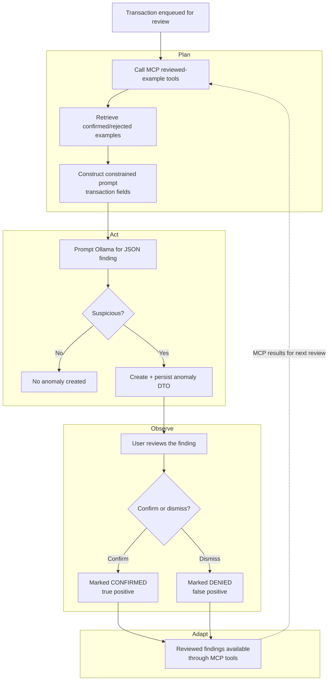

# Anomalies Backend

## Overview

The backend is a Flask application that provides the anomaly-detection API. It
coordinates transaction retrieval, asynchronous reviews, model requests, and
anomaly persistence. The application starts a daemon review worker when it is
initialised and returns JSON for API responses or rendered Jinja fragments for
the frontend.

Transactions are submitted for review as `dto.Transaction` objects. The backend
does not store transaction records itself; it retrieves transactions from the
transactions database and sends detected anomalies to the anomalies database.
Configuration such as service URLs, the model name, and polling timeouts is
read from environment variables in `config.py`. Values are resolved lazily, so
reading one raises a `RuntimeError` if the variable is unset or invalid;
`config.check_all()` validates every variable up front (it runs on startup).
The Compose deployment sets `MCP_SERVER_URL` to the host machine's MCP server
at `http://host.docker.internal:8000/mcp`; the MCP server is not containerised.

## Agentic workflow

1. The frontend sends a transaction to `POST /check-transaction`.
2. The backend validates and deserialises the request into a transaction DTO.
3. The transaction is placed on the in-process review queue, and the endpoint
   immediately returns `HTTP 202 (Accepted)` with the transaction ID.
4. A background worker passes the transaction to the agent.
5. The agent uses the MCP server's
   `get-transactions-with-confirmed-anomalies` and
   `get-transactions-with-rejected-anomalies` tools to retrieve reviewed
   examples before classifying the transaction.
6. The model must return JSON containing `is_suspicious` and `justification`.
   Invalid responses are retried with increasing temperature, up to four
   attempts.
7. If the transaction is suspicious, the resulting anomaly is written to the
   anomalies database. Otherwise, no anomaly is created.
8. The worker marks the transaction as complete. The frontend can poll
   `GET /anomaly-alert?key=<transaction-id>` for a rendered alert fragment.

The agent is instructed to be cautious, avoid claiming fraud as fact, use only
the supplied transaction information, and incorporate the user's previous
confirmation or dismissal decisions.

## Plan–Act–Observe–Adapt workflow

The anomaly review implements a **Plan → Act → Observe → Adapt** loop whose
cycle spans *across* reviews: the user's decisions on one finding shape how the
agent judges the next transaction.

- **Plan** — Before classifying the transaction, the model calls the MCP
  server's `get-transactions-with-confirmed-anomalies` and
  `get-transactions-with-rejected-anomalies` tools. These return reviewed
  transactions and their anomaly records as positive and negative examples.
  The plan for judging the current transaction is therefore shaped by the
  accumulated human feedback without embedding that history in the prompt.
- **Act** — The agent sends the system and user prompts to the model through
  `ollama_api.prompt`, requesting a JSON finding with `is_suspicious` and
  `justification`. A valid, suspicious finding is converted to an anomaly DTO
  and persisted so it can be shown to the user. (Malformed responses are simply
  retried with a higher temperature, up to four attempts — a robustness detail,
  not part of the adaptation loop.)
- **Observe** — The persisted finding is surfaced to the user, who reviews it
  and records the ground truth by **confirming** it as genuinely suspicious
  (true positive) or **dismissing** it as a false positive. This human review
  is the observation of how well the agent's judgement matched reality.
- **Adapt** — Those confirmed/denied decisions are exactly the reviewed findings
  returned by the MCP tools on the *next* review. The agent treats transactions
  similar to confirmed findings as more likely suspicious, and avoids
  re-flagging transactions similar to denied ones. The loop then returns to Plan
  for the next transaction, with the agent's behaviour adapted to the user's
  accumulated feedback.

## Services

### `services/agent_api.py`

Implements the anomaly-detection agent. It creates prompts that instruct the
model to use the MCP reviewed-example tools, parses model JSON, validates the
expected response fields, and converts suspicious findings into anomaly DTOs.

### `ai-services/mcp-server/server.py`

Provides transaction search plus
`get-transactions-with-confirmed-anomalies` and
`get-transactions-with-rejected-anomalies`. The reviewed-example tools join
anomaly records from the anomalies database to their corresponding
transactions.

### `services/review_queue.py`

Provides the in-process queue and daemon worker. It tracks pending and
completed transaction IDs, runs reviews outside the request thread, persists
findings, and allows callers to wait for a specific transaction's result.

### `services/anomalies_api.py`

HTTP client for the anomalies database. It retrieves all anomalies, looks up an
anomaly by transaction ID, creates anomalies, and updates user confirmation
status.

### `services/transaction_api.py`

HTTP client for the transactions database. It retrieves transaction records
used for anomaly listings and agent context.

### `services/ollama_api.py`

OpenAI-compatible client wrapper for the model server. It caches one client
instance and sends system and user prompts with the configured model,
temperature, token limit, and timeout. The returned model output and usage
metadata are emitted at DEBUG level for troubleshooting; hidden chain-of-thought
is not logged. Anomaly reviews also request and log a concise,
user-safe `reasoning_summary` when the model provides one.

### `helpers.py`

Contains request DTO deserialisation, DTO serialisation, and environment
variable helpers used by the application and integration clients.

## Routes

| Method | Route | Purpose |
| --- | --- | --- |
| `GET` | `/` | Returns the backend health response. |
| `GET` | `/fact` | Requests and returns a random fact from the configured model. |
| `GET` | `/anomalies` | Retrieves anomalies and transactions, then renders the anomaly list. |
| `POST` | `/check-transaction` | Validates and queues a transaction for asynchronous review; returns `202`. |
| `GET` | `/anomaly-alert?key=<id>` | Waits for a queued review and returns an alert fragment when an anomaly exists, otherwise `204`. |
| `POST` | `/anomalies/<id>/confirm` | Marks an anomaly as confirmed and returns the refreshed anomaly list. |
| `POST` | `/anomalies/<id>/dismiss` | Marks an anomaly as dismissed and returns the refreshed anomaly list. |
| `POST` | `/dummy-anomaly` | Creates a random test anomaly and returns the refreshed anomaly list. |
