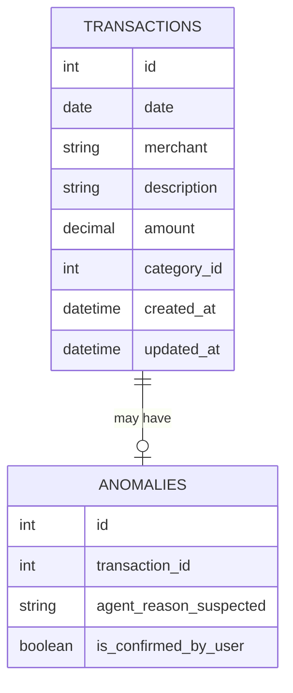
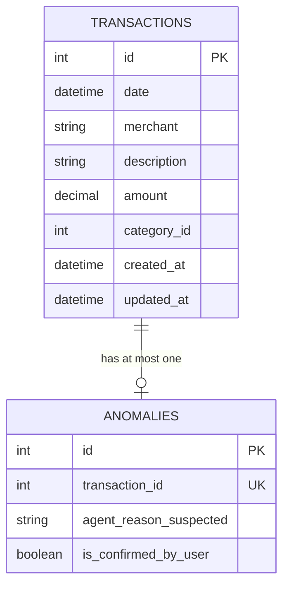
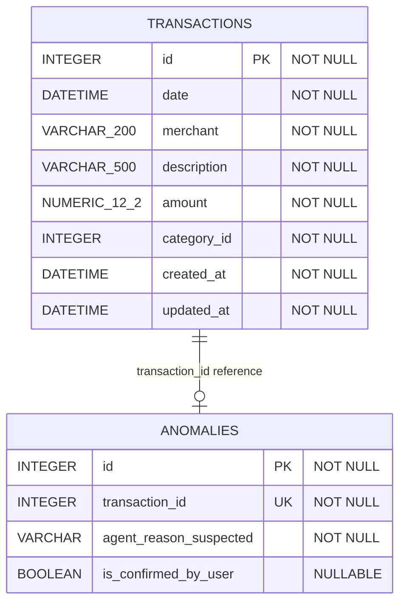

# Anomalies Database

## Overview

The anomalies database is a Flask and SQLAlchemy application that exposes a
REST API for storing and managing anomaly records. It persists data in SQLite.
Each anomaly references a transaction by ID, and the unique constraint on
`anomalies.transaction_id` allows each transaction to have at most one anomaly.

The `transactions` table and `anomalies` table are stored in separate databases. Therefore, the relationship between `anomalies.transaction_id` and `transactions.id` is a logical cross-database reference rather than an enforced database foreign key. The `UNIQUE` constraint on `anomalies.transaction_id` ensures that each transaction can have zero or one anomaly.

## Startup reconciliation

Because the reference to `transactions.id` is not an enforced foreign key,
anomalies can become orphaned if a transaction is deleted while the anomalies
database is unavailable. To recover from this, the container runs a
reconciliation pass in a background thread when it starts, so the API begins
serving requests immediately while cleanup proceeds:

1. It polls the transactions database (`GET {TRANSACTIONS_DB_URL}/transactions`),
   retrying until the service is reachable.
2. It deletes any anomaly whose `transaction_id` is not present in the returned
   set of transactions.

This requires the `transactions-db` container to be running, so `anomalies-db`
declares a `depends_on` relationship on it in `docker-compose.yml`. The pass is
best-effort: if the transactions database cannot be reached within the retry
budget, reconciliation is skipped and logged rather than crashing the container.

The behaviour is configured through environment variables, all of which are
required:

| Variable | Purpose |
| --- | --- |
| `TRANSACTIONS_DB_URL` | Base URL of the transactions database. |
| `TRANSACTIONS_TIMEOUT_SECONDS` | Per-request timeout when polling transactions. |
| `RECONCILE_MAX_RETRIES` | Number of polling attempts before giving up. |
| `RECONCILE_RETRY_DELAY_SECONDS` | Delay between polling attempts. |

## Routes

| Method | Route | Purpose |
| --- | --- | --- |
| `GET` | `/` | Returns the database health response. |
| `GET` | `/anomalies/` | Returns all anomaly records. |
| `POST` | `/anomalies/` | Creates an anomaly record. |
| `GET` | `/anomalies/<id>` | Returns one anomaly by ID. |
| `GET` | `/anomalies/by-transaction/<id>` | Returns the anomaly for a transaction. |
| `PATCH` | `/anomalies/<id>` | Updates the user's confirmation status. |
| `DELETE` | `/anomalies/<id>` | Deletes an anomaly by ID. |
| `DELETE` | `/anomalies/by-transaction/<id>` | Deletes the anomaly for a transaction. |

## Conceptual ERD

## Logical ERD

## Physical ERD

