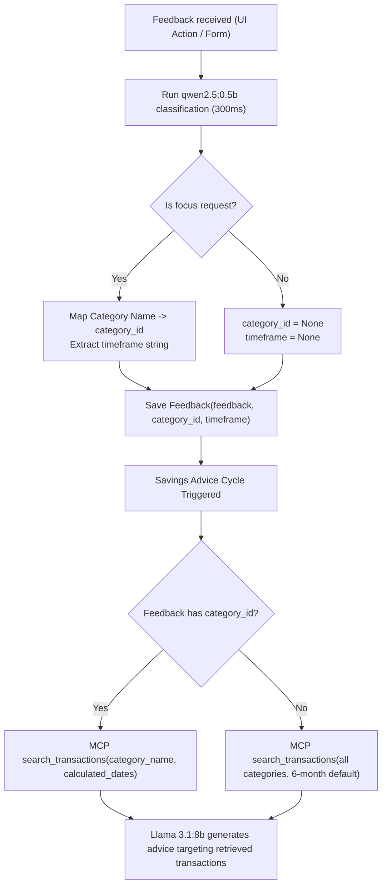

# Implementation Design: Feedback Category Logical FK & Sub-Second Auto-Classification

## 1. Overview & Motivation

### 1.1 Problem Statement
When generating savings advice, the agent uses a 2-stage model pipeline:
1. **Tool Calling Model (`qwen2.5:3b`)**: Inspects feedback history to determine parameters (`start_date`, `end_date`, `category_name`) for the MCP `search_transactions` tool.
2. **Advice Planner Model (`llama3.1:8b`)**: Evaluates retrieved transactions alongside active goals and past suggestions to generate actionable advice.

Previously, all user feedback was stored as unstructured text in `Feedback.feedback`. When multiple background rules existed (e.g., *"Don't cancel Netflix"*, *"Reduce recurring subscriptions"*), `qwen2.5:3b` frequently suffered from attention diffusion across the 11 bullet points, misinterpreting negative constraints as active search directives and defaulting to `category_name="Streaming subscriptions"`, even when the user explicitly asked to focus on transport.

### 1.2 Core Architectural Solution
Rather than relying on an LLM to guess intent across historical text blobs, we introduce:
1. **Structured Persistence**: Store `category_id` (a cross-service logical Foreign Key to `categories.id` in `transactions-db`) and `timeframe` directly on the `Feedback` model.
2. **Sub-Second Auto-Classification**: At feedback creation time (`POST /feedback` or `POST /ai-suggestion/action`), run a single-sentence classification with `qwen2.5:0.5b` (~0.3s-0.8s on CPU). If the user requests to focus on a spending area and/or timeframe, extract the category and relative timeframe automatically without requiring any extra user form fields.
3. **Deterministic MCP Querying**: When fetching transactions via MCP, `generate_transaction_search_args` directly references the structured `category_id` and `timeframe`, eliminating ambiguity completely.

---

## 2. Architecture & Data Model

### 2.1 Cross-Service Logical Foreign Key Pattern
Each microservice in the application maintains its own SQLite database (`transactions.db`, `savings.db`, `anomalies.db`). Therefore, physical SQL foreign key constraints cannot cross database boundaries.

Following the pattern established by the **anomalies** service (which references `transactions.id` via `Anomaly.transaction_id: int`), `Feedback` will store `category_id: int` referencing `categories.id` from `transactions-db` (Port 6001).

```mermaid
erDiagram
    CATEGORIES ||--o{ TRANSACTIONS : "categorizes"
    CATEGORIES ||--o{ FEEDBACK : "logically references (cross-service)"
    SUGGESTIONS ||--o{ FEEDBACK : "evaluates (intra-service FK)"

    CATEGORIES {
        INTEGER id PK
        VARCHAR name
        VARCHAR type
    }

    SUGGESTIONS {
        INTEGER id PK
        VARCHAR suggestion
        BOOLEAN accepted
    }

    FEEDBACK {
        INTEGER id PK
        VARCHAR feedback
        INTEGER suggestion_id FK "nullable"
        INTEGER category_id LogicalFK "nullable"
        VARCHAR timeframe "nullable"
    }
```

### 2.2 Schema Specifications

#### Database Model (`david/database/models.py`)
```python
@dataclass
class Feedback(db.Model):
    id: Mapped[int] = mapped_column(primary_key=True)
    feedback: Mapped[str] = mapped_column(nullable=False)
    suggestion_id: Mapped[Optional[int]] = mapped_column(
        db.ForeignKey("suggestion.id", ondelete="CASCADE"), nullable=True
    )
    category_id: Mapped[Optional[int]] = mapped_column(nullable=True)
    timeframe: Mapped[Optional[str]] = mapped_column(nullable=True)
    suggestion: Mapped[Optional["Suggestion"]] = db.relationship(
        "Suggestion",
        backref=db.backref("feedbacks", cascade="all, delete-orphan"),
        foreign_keys=[suggestion_id],
    )

    def to_dto(self):
        return dto.Feedback(
            self.id,
            self.feedback,
            self.suggestion_id,
            self.category_id,
            self.timeframe,
        )
```

#### Shared DTO (`shared/backend/dto.py`)
```python
@dataclass
class Feedback:
    id: Optional[int]
    feedback: str
    suggestion_id: Optional[int] = None
    category_id: Optional[int] = None
    timeframe: Optional[str] = None
```

---

## 3. Auto-Classification Pipeline (`qwen2.5:0.5b`)

### 3.1 Timing & Performance Benchmarks
A 0.5B parameter model (`qwen2.5:0.5b`) on CPU executes single-sentence classification with sub-second latency, avoiding any perceptible delay on submission:

| Input Text | Latency | Extracted Output |
| :--- | :--- | :--- |
| `"I want to focus on transport"` | 0.82s | `{"is_focus": true, "category": "Transport", "timeframe": null}` |
| `"Focus on transport for the last month"` | 0.38s | `{"is_focus": true, "category": "Transport", "timeframe": "1 month"}` |
| `"Cut down on dining over the past 2 weeks"` | 0.41s | `{"is_focus": true, "category": "Dining", "timeframe": "2 weeks"}` |
| `"I don't want to cancel my Netflix subscription"` | 0.35s | `{"is_focus": false, "category": null, "timeframe": null}` |
| `"I cannot change electricity providers"` | 0.34s | `{"is_focus": false, "category": null, "timeframe": null}` |

### 3.2 Classification Function (`david/backend/savings-service/classifier.py`)
```python
def classify_feedback(feedback_text: str, categories: List[dto.Category]) -> tuple[Optional[int], Optional[str]]:
    """
    Classifies a single feedback sentence using qwen2.5:0.5b.
    Returns (category_id, timeframe) if an active focus request is identified,
    or (None, None) if it is a general rule/constraint.
    """
    if not feedback_text or not feedback_text.strip():
        return None, None

    category_names = [c.name for c in categories]
    prompt = (
        "Task: Determine if the user feedback is an active request to focus on a spending category and/or timeframe.\n"
        f"Valid categories: {', '.join(category_names)}\n\n"
        f"User feedback: \"{feedback_text.strip()}\"\n\n"
        "Guidelines:\n"
        "- If the user asks to focus on, investigate, or reduce spending in a specific category, set is_focus to true and category to the exact matching category name.\n"
        "- If it is a negative constraint or general lifestyle rule (e.g. 'don't cancel X', 'keep Y'), set is_focus to false and category to null.\n"
        "- Extract any timeframe (e.g. 'last month', '2 weeks'), or null.\n\n"
        "Respond in JSON format: {\"is_focus\": true/false, \"category\": \"Name\" or null, \"timeframe\": \"timeframe\" or null}"
    )

    try:
        resp = client.chat.completions.create(
            model="qwen2.5:0.5b",
            messages=[{"role": "user", "content": prompt}],
            response_format={"type": "json_object"},
            temperature=0.0,
        )
        data = json.loads(resp.choices[0].message.content)
        if data.get("is_focus") and data.get("category"):
            matched_cat = next((c for c in categories if c.name.lower() == str(data["category"]).lower()), None)
            if matched_cat:
                return matched_cat.id, data.get("timeframe")
    except Exception:
        pass

    return None, None
```

---

## 4. MCP Transaction Search Integration

### 4.1 Parameter Resolution
When `generate_transaction_search_args(feedbacks)` is called:
1. Identify the latest focus feedback (checking from newest to oldest in `feedbacks`).
2. If a feedback has `category_id`, resolve `category_name` via `fetch_categories_map()`.
3. If `timeframe` is present, calculate `start_date` dynamically relative to `today` (e.g. `"1 month"` &rarr; `today - relativedelta(months=1)`, `"2 weeks"` &rarr; `today - timedelta(days=14)`).
4. If no specific category/timeframe is specified, use the fallback 6-month window across all categories (`category_name = None`).



---

## 5. Step-by-Step Implementation Roadmap (For Feature Branch)

### Chunk 1: Database & DTO Schema
1. **`shared/backend/dto.py`**:
   - Add `category_id: Optional[int] = None` and `timeframe: Optional[str] = None` to `Feedback` dataclass.
2. **`david/database/models.py`**:
   - Add `category_id: Mapped[Optional[int]] = mapped_column(nullable=True)`.
   - Add `timeframe: Mapped[Optional[str]] = mapped_column(nullable=True)`.
   - Update `to_dto()` method.
3. **`david/database/app.py`**:
   - Update `POST /feedback` to accept `category_id` and `timeframe`.
   - Update `PATCH /feedback/<id>` to allow updating `category_id` and `timeframe`.
4. **`david/database/seed.py`**:
   - Existing 10 seed entries retain `category_id=None, timeframe=None` (backward compatible).

### Chunk 2: Backend Auto-Classifier & Endpoints
1. **`david/backend/savings-service/classifier.py`**:
   - Implement `classify_feedback(feedback_text, categories)`.
2. **`david/backend/savings-service/app.py`**:
   - In `action_ai_suggestion()`: Run `classify_feedback` on incoming suggestion feedback before `POST {db_url}/feedback`.
   - In `create_feedback()`: Run `classify_feedback` on incoming general feedback before `POST {db_url}/feedback`.

### Chunk 3: Ollama Transaction Query Integration
1. **`david/backend/savings-service/ollama_service.py`**:
   - Update `generate_transaction_search_args(feedbacks)` to directly check for `f.category_id` and `f.timeframe`.
   - Dynamically compute `start_date` based on `timeframe` (days, weeks, months).
   - Omit `category_name` when no focus is set so all categories are analyzed.

### Chunk 4: Tests & Verification
1. **`david/test/test_database.py`**:
   - Test `category_id` and `timeframe` persistence, retrieval, and cascading updates.
2. **`david/test/test_classifier.py`**:
   - Test classifier extraction against sample inputs (focus requests vs constraints).
3. **End-to-End Test**:
   - Submit *"I want to focus on transport for the last month"*.
   - Verify `Feedback.category_id = 70` (Transport).
   - Verify MCP call is `GET /transactions?category_name=Transport&date_from=...`.
   - Verify advice generation only references transport transactions (e.g. Opal card).
