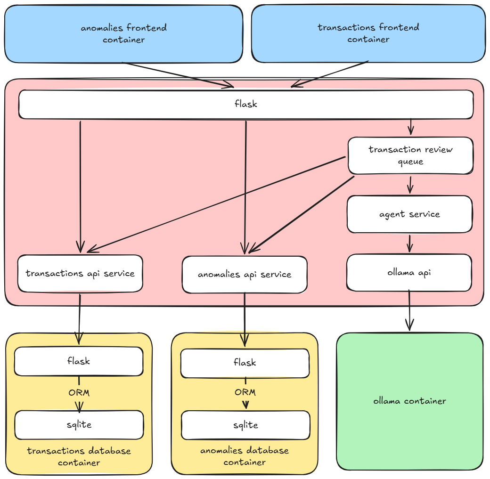

# Release 0 - Anomaly Detection Service

Release 0 captures the current architecture of the AI-assisted
anomaly-detection feature for transaction review. The main frontend, backend,
database, and model components are implemented and run through Docker Compose.
Further development is expected, including the planned addition of a RAG/MCP
server to provide the agent with structured retrieval and tool access.

## Feature summary

The frontend provides an anomaly list, transaction review controls, status
updates, and confirmation or dismissal actions. A transaction can be submitted
to the backend for asynchronous review. The backend places the transaction on
an in-process queue, gathers transaction and anomaly context, and sends a
structured prompt to the configured Ollama model. Suspicious findings are
validated and persisted as anomaly records. Previously confirmed or dismissed
findings are included as feedback context for later reviews.

The anomalies database exposes a Flask REST API backed by SQLAlchemy and
SQLite. Each anomaly stores the related transaction ID, the agent's reason, and
the user's confirmation status. Transactions and anomalies are stored in
separate databases, so the relationship is represented by ID and is not an
enforced cross-database foreign key. Each transaction can have at most one
anomaly.

## Architecture

The frontend proxies backend requests through `/anomalies-backend/`. The
backend communicates with the anomalies and transactions APIs over HTTP and
uses an OpenAI-compatible client to call Ollama. The database API maps anomaly
routes to the SQLAlchemy model, which persists records in SQLite.

## Agentic workflow

1. A transaction is submitted through `POST /check-transaction`.
2. The backend validates the transaction and returns `202` after queueing it.
3. A background worker loads existing anomalies and transactions.
4. The agent prompts Ollama for a JSON finding containing
   `is_suspicious` and `justification`.
5. Invalid model responses are retried up to four times with increasing
   temperature.
6. Suspicious findings are saved to the anomalies database.
7. The frontend polls `/anomaly-alert` for the completed review.
8. Users can confirm or dismiss findings, providing future review context.

## Routes and persistence

The backend supports health checks, anomaly listing, transaction submission,
review-result polling, confirmation, dismissal, dummy anomaly creation, and
model fact generation. The database supports anomaly creation, retrieval,
lookup by transaction, confirmation updates, and deletion by ID or transaction.

## Testing and CI

The test suite uses pytest, mypy, and an in-memory SQLite database. Backend
tests run through Flask's test client, mock Ollama responses with monkeypatching,
and use `responses.RequestsMock` to redirect HTTP calls to the anomalies and
transactions Flask test clients. This exercises the real service clients
without requiring running containers.

The [`aiden-ci.yml`](../../../.github/workflows/aiden-ci.yml) workflow runs on pull requests targeting `main` when relevant
workflow, Compose, Aiden, shared, or database files change. The test job
installs dependencies, runs mypy, and runs pytest. The build-health job starts
the frontend, backend, and database containers, checks ports `3004`, `5004`,
and `6004`, collects logs on failure, and removes the containers afterward.

## Current snapshot and future work

The core anomaly-detection workflow is implemented end to end, including
asynchronous processing, model integration, persistence, user feedback, and
service-level tests. This document represents a Release 0 snapshot rather
than a final architecture. Planned changes include integrating a RAG/MCP
server so the agent can retrieve relevant transaction context and use defined
tools during review. The existing service boundaries may therefore evolve as
retrieval and tool access are introduced.

Documentation for the current implementation is maintained in the anomalies
documentation:

- [Anomalies overview](../../../aiden/README.md)
- [Frontend documentation](../../../aiden/frontend.md)
- [Backend documentation](../../../aiden/backend.md)
- [Database documentation](../../../aiden/database.md)
- [Test documentation](../../../aiden/tests.md)

## Evidence

TODO put NFR tests and screenshots here.
