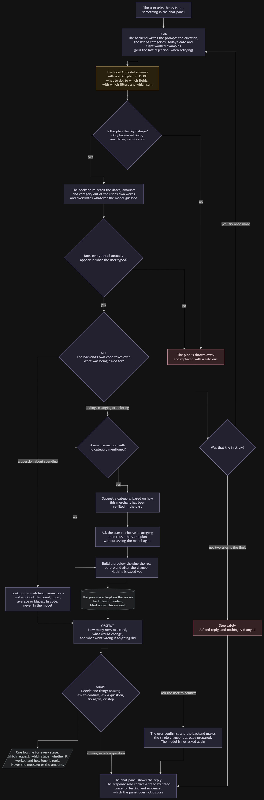

# Janelle Release 0

This directory contains the Release 0 documentation and captured evidence for
the Transactions service. The current implementation and operating guide is
[`janelle/README.md`](../../../janelle/README.md).

## Artifact inventory

| Artifact | Purpose |
|---|---|
| [`Transactions-AI-Workflow.jpg`](Transactions-AI-Workflow.jpg) | Transaction assistant workflow diagram. |
| [`evidence/nfr-baseline.json`](evidence/nfr-baseline.json) | Repeatable SQLite transaction-read latency and concurrency baseline. |
| [`evidence/endpoint-smoke.json`](evidence/endpoint-smoke.json) | Captured backend and database health, CRUD, validation, and cleanup results. |
| [`evidence/ai-workflow.log`](evidence/ai-workflow.log) | Redacted structured logs for an initial planning cycle and its confirmed write cycle. |
| [`prompt-engineering/transactions-backend-crud-and-add-transaction-ui.md`](prompt-engineering/transactions-backend-crud-and-add-transaction-ui.md) | Historical prompt record for the backend CRUD and transaction UI work. |
| [`prompt-engineering/transactions-agentic-crud-implementation.md`](prompt-engineering/transactions-agentic-crud-implementation.md) | Historical prompt record for the guarded agentic CRUD workflow. |
| [`prompt-engineering/transactions-ui-enhancements.md`](prompt-engineering/transactions-ui-enhancements.md) | Historical prompt record for pagination, filters, category UI, and related refinements. |

The prompt-engineering files record the implementation process and may describe
intermediate designs that were later changed. The current source code and
`janelle/README.md` are authoritative for runtime behavior.

## Captured results

| Area | Captured result |
|---|---|
| Database NFR | Passed 100 sequential reads with 2.022 ms p95 and zero errors. Passed 40 reads across 8 workers in 133.885 ms at 298.76 requests/second, also with zero errors. |
| Endpoint smoke | Passed backend and database health checks, list requests, category CRUD, transaction CRUD, invalid chat request handling, and synthetic-data cleanup. |
| AI workflow logging | One request ID links an initial `confirm` cycle to a confirmed `complete` cycle. Both contain PLAN, ACT, OBSERVE, and ADAPT stage records using `qwen2.5:3b`. |

## Workflow diagram



## NFR evidence

The baseline in `evidence/nfr-baseline.json` was produced by
`janelle/scripts/test/janelle_nfr_probe.py`. The probe creates a temporary
SQLite database, warms the application, and measures transaction-list reads.

It enforces:

- zero errors across 100 sequential requests;
- sequential p95 latency no greater than 250 ms;
- zero errors across 40 parallel requests using 8 workers;
- completion of the parallel run within 10 seconds.

The captured run reported:

| Measurement | Result |
|---|---:|
| Sequential p50 | 1.748 ms |
| Sequential p95 | 2.022 ms |
| Sequential maximum | 2.146 ms |
| Parallel p95 | 29.284 ms |
| Parallel elapsed time | 133.885 ms |
| Parallel throughput | 298.76 requests/second |
| Errors | 0 |

These measurements are a local regression baseline, not a production capacity
claim.

## Endpoint evidence

The capture in `evidence/endpoint-smoke.json` was generated on 8 September
2026. It records successful checks for:

1. backend and database health;
2. category and transaction list endpoints through both API layers;
3. category create, read, update, persistence, delete, and cleanup;
4. transaction create, read, update, persistence, delete, and cleanup;
5. rejection of an invalid chat request with HTTP `422`.

The capture was run with the frontend skipped. Its `frontend_health`,
`frontend_root`, and `frontend_backend_proxy` values are therefore `not_run`.
Running the probe without `--skip-frontend` also checks nginx health, the
application page, and the `/transactions-backend/` proxy.

## AI workflow evidence

`evidence/ai-workflow.log` contains redacted `AI_WORKFLOW` records for one
request. The initial phase:

- completed PLAN, ACT, OBSERVE, and ADAPT in one iteration;
- returned `confirm` without performing the proposed write;
- took 12,168.824 ms, of which 12,168.412 ms was the Ollama planning stage.

The confirmed phase reused the same request ID:

- completed PLAN, ACT, OBSERVE, and ADAPT in one iteration;
- returned `complete`;
- took 58.651 ms, including a 58.623 ms write action.

The log records request ID, phase, model, iteration, stage, status, duration,
and safe error metadata. It deliberately excludes user messages, prompts,
transaction values, and model response bodies.

The committed log demonstrates the workflow trace and phase transition. It
does not contain the full probe response or database before/after rows. Run
`janelle_ai_workflow_probe.py` to reproduce the stronger assertions that
planning performs no write, confirmation performs exactly one verified write,
and the synthetic transaction is removed afterward.

## Evidence limitations

- No pytest coverage report or CI transcript is stored in this directory, so
  this document does not claim a test count or coverage percentage.
- The committed endpoint capture does not include the frontend checks.
- The AI log is operational trace evidence rather than a complete request and
  response transcript.
- Prompt-engineering records are historical development records, not test
  results.

## Reproduce

Install the test dependencies from the repository root:

```powershell
python -m pip install -r janelle\backend\requirements.txt -r janelle\database\requirements.txt -r janelle\test\requirements.txt
```

Run the automated suite and the self-contained NFR probe:

```powershell
python -m pytest janelle\test -q
python janelle\scripts\test\janelle_nfr_probe.py
```

Start the live services:

```powershell
docker compose up --build -d ollama transactions-db transactions-backend transactions-frontend
```

Then run the endpoint and AI probes:

```powershell
python janelle\scripts\test\janelle_endpoint_smoke.py
python janelle\scripts\test\janelle_ai_workflow_probe.py
```

Each probe accepts `--output <path>` to save its JSON output. The endpoint
probe defaults to frontend, backend, and database URLs on ports `3001`, `5001`,
and `6001`. The AI probe requires the backend, database, Ollama, and configured
`qwen2.5:3b` model.
